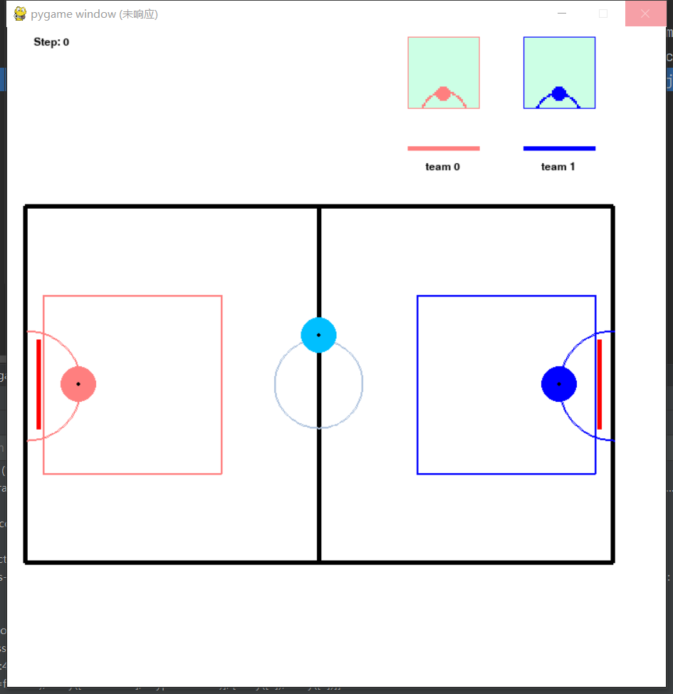

## 场地介绍

* 从左下角开始，顺时针方向，场地的四个角的坐标为：(20, 200), (20, 600), (680, 600), (680, 200)
* agent_0: 淡红色，半径20，初始坐标为 (80, 400)
* agent_1: 蓝色，半径20，初始坐标为 (620, 400)
* ball: 靛蓝色，半径20，初始坐标为 (350, random(300, 500))
* 左侧球门：最下面和最上面，坐标为(665, 350), (665, 450)
* 右侧球门：最下面和最上面，坐标为(35, 350), (35, 450)
* 中心灰色圆：圆心(350, 400)，半径50
* 左侧球门半圆：圆心(22.5, 402.5)，半径62.5
* 右侧球门半圆：圆心(682.5, 402.5)，半径62.5

## 智能体属性介绍

### agent:
* obs:  40 * 40的矩形的局部观测，智能体朝向的左手边为矩形的(0, 0)位置，智能体圆心在矩形的(19.5, 31.5)上，往上下左右跨3.5格

  | 场中颜色 | obs中对应的值 |
  | :------: | :-----------: |
  |  淡红色  |     10.0      |
  |   蓝色   |      8.0      |
  |   黑色   |      6.0      |
  |   红色   |      7.0      |
  |   灰色   |      4.0      |
  |  靛蓝色  |      2.0      |
  |   白色   |       0       |

* action:  [Box(-100.0, 200.0, (1,), float32), Box(-30.0, 30.0, (1,), float32)]。分别代表施加力量force和转向角度Δtheta。

* **内在属性：**

  |        名称         |                           值/公式                            |                     解释                     |
  | :-----------------: | :----------------------------------------------------------: | :------------------------------------------: |
  |        mass         |                              1                               |                  智能体质量                  |
  |     energy_cap      |                             1000                             |                智能体最大能量                |
  |         tau         |                             0.1                              |              一个step的持续时间              |
  |      speed_cap      |                             100                              |               智能体的最大速率               |
  | energy_recover_rate |                             200                              |        单位时间，智能体的能量恢复速度        |
  |        theta        |                  theta = theta_old + Δtheta                  |  智能体朝向角度，水平向右为0度，逆时针为正   |
  |        accel        | accel_x = force * cos(theta / 180 * math.pi)  accel_y = force * sin(theta / 180 * math.pi) | 智能体加速度，不受碰撞影响吗，energy为0时为0 |
  |    consume_rate     |                          force*v/50                          |    单位时间智能体消耗的能量，v为速度的模     |
  |       energy        |           energy = energy_old - consume_rate * tau           |                智能体当前能量                |
  |         pos         |                      根据动作和碰撞计算                      |            智能体在场中的当前位置            |
  |          v          |                             同上                             |                智能体当前速度                |

  以上属性仅针对agent，ball的accel始终为0，v和pos依据碰撞计算，无energy。